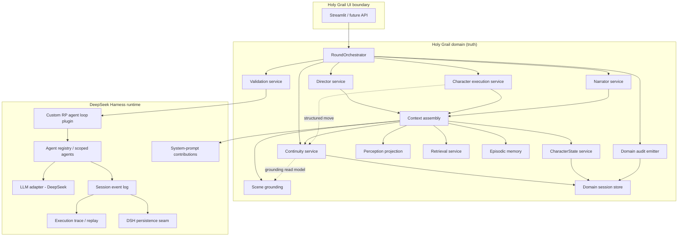

# Holy Grail V2 — Capability → DSH Mapping & Target Architecture

**Status:** Proposed architecture (baseline phase)  
**DSH evaluated:** `@deepseek-ai/dsh@0.1.0-rc.7`, `@deepseek-ai/cordis@4.0.1` (npm registry, 2026-03-17)  
**Primary sources:** [deepseek-ai/deepseek-harness](https://github.com/deepseek-ai/deepseek-harness), [DSH docs](https://deepseek-harness.github.io/deepseek-harness/en/), Cordis framework docs (services, events, plugins, agent lifecycle, session subsystem)

> **Note:** DSH is in developer preview. APIs and plugin surfaces may change. Commit SHA was not pinned in this baseline (upstream default branch not fetched as a git submodule). Re-pin before implementation.

---

## DSH concepts relevant to Holy Grail

| DSH concept | Relevance to HG |
|-------------|-----------------|
| **Cordis plugins** | Composition unit for RP runtime seams (Director loop, perception, validation hooks) |
| **Services** (`ctx.llm`, `ctx.agents`, `ctx.sessions`, `ctx.systemPrompt`, `ctx.tools`) | Replace ad-hoc AutoGen client wiring |
| **Custom agent loop** | RP round is not a single coding-agent turn; likely custom loop plugin |
| **Session event log** | Execution provenance, replay, token usage — **not** continuity truth |
| **System-prompt contributions** | Per-role context assembly (Director, character, Narrator) |
| **`agent/pre-step` waterfall** | Validation retry, context injection, steering before model call |
| **`agent/*` live events** | Turn coordination, cancellation, status |
| **Agent scoping (`scope/`)** | Per-character agent instances with isolated contributions |
| **LLM adapters** | DeepSeek provider via DSH `ctx.llm` |
| **Persistence seam** | Separate HG domain persistence from DSH session durability |

---

## Capability mapping

Classification key: **Preserve** | **Re-express** | **Replace** | **Split** | **Obsolete** | **Decision needed**

| Holy Grail capability | Current V1 implementation | Proposed DSH-native home | Class | Rationale |
|----------------------|---------------------------|--------------------------|-------|-----------|
| **RP round lifecycle** | `turn_runner.py`, `app_turn_*.py`, Streamlit event loop | **Custom agent-loop plugin** + HG **RoundOrchestrator service** | Split | DSH default loop is single-agent step/turn; HG needs multi-actor rounds (user → Director → N characters → Narrator → continuity). Loop plugin drives phases; HG service owns RP semantics. |
| **Director** | `app_turn_director.py`, `model_client.create_director_agent`, AutoGen agent | **HG Director service** invoking **scoped DSH Agent** (or direct `ctx.llm` call) | Re-express | Director is domain-specific JSON contract, not a generic coding agent. Keep HG prompt/parse logic; use DSH for invocation, events, retry surfaces. |
| **Character execution** | `turn_runner_character_attempt.py`, AutoGen character agents | **Per-character scoped Agent** + HG **CharacterMove service** | Split | Each bot character gets scoped context contributions; structured move validation stays HG. DSH records requests/responses; HG commits moves. |
| **Narrator** | `app_turn_rendering.py`, AutoGen narrator agent | **HG Narrator service** + scoped Agent or `ctx.llm` | Re-express | Presentation-only role maps cleanly to a single model call with HG-owned prompt. Not a DSH coding-agent tool loop. |
| **Validation / retry** | `response_validation_*.py`, `semantic_validation.py`, `turn_runner_character_attempt.py` | **`agent/pre-step` / `agent/request-error` interception** + HG **Validation service** | Split | DSH provides lifecycle hooks and retry/compaction patterns; HG owns domain rules (presence, drift, proposal legality). |
| **Continuity** | `continuity_manager.py`, `continuity_*` modules | **HG Continuity domain service** (pure domain, no DSH coupling) | Preserve | Authoritative truth must remain HG-owned per #224. DSH session log must not become continuity store. |
| **Character state** | `character_state_model.py`, `character_state_manager.py` | **HG CharacterState service** | Preserve | Private per-character state is domain truth; project into prompts via HG context layer. |
| **Perception** | `perception_audibility.py` | **HG Perception projection service** (plugin) | Re-express | Filters what enters each character's derived context. Natural fit for pre-prompt projection, not DSH session storage. |
| **Scene grounding** | `scene_grounding.py`, `prompt_grounding_assembly.py` | **HG SceneGrounding service** → **system-prompt contribution** | Split | Facts derived from continuity; contributed via DSH `ctx.systemPrompt` from HG read model. |
| **Relationships** | `character_state_manager.py`, cross-session policy | **HG Relationship service** (domain) | Preserve | Domain truth; may later use graph store behind interface. |
| **Authored retrieval** | `retrieved_context_select.py`, `prompt_retrieval_assembly.py` | **HG Retrieval service** (plugin) + optional vector backend | Re-express | Select/merge/bundle stays HG; storage backend swappable. Contribute formatted section to prompt assembly. |
| **Episodic memory** | `memory_layer/`, `episodic_memory_*` | **HG EpisodicMemory service** | Re-express | Write policy on continuity commit; read path feeds retrieval merge. Not DSH session history. |
| **Context construction** | `app_turn_prompting.py`, `prompt_builders.py`, `runtime_packets.py` | **HG ContextAssembly service** → DSH **system-prompt contributions** | Split | HG remains source of truth for packet assembly; DSH assembles final model prefix from contributions. Phase 0.5 packet seam migrates here. |
| **Model invocation** | `model_client.py`, AutoGen `OpenAIChatCompletionClient` | **DSH `ctx.llm`** + DeepSeek adapter | Replace | Drop AutoGen client when DSH path proven. HG calls adapter with assembled messages. |
| **Provider selection** | `model_client.py` env (`DEEPSEEK_MODEL`, etc.) | **DSH provider/model config** + HG env bridge | Replace | Centralize in DSH composition config; HG reads same env for parity during transition. |
| **Audits** | `audit_logger.py`, `turn_runner_audit.py` | **Split:** DSH **session/event** trace + HG **domain audit events** | Split | Model prompts/responses in DSH log; continuity snapshots, CTAR, retrieval summary remain HG audit schema. Correlate by `continuity_turn_index` + session ids. |
| **Session persistence** | `session_manager.py`, JSON on disk | **Split:** HG **domain session store** + DSH **session persistence** | Split | `session_id` (UUID) and cast/scene state are HG; DSH stores execution replay separately. Link via metadata, not merge. |
| **Headless execution** | `headless_session_prepare.py`, `run_scene_simulation_llm.py` | **DSH composition CLI** + HG **HeadlessDriver** | Re-express | Same HG round orchestrator; UI replaced by driver feeding user triggers. |
| **UI (Streamlit)** | `app.py`, `ui_*.py` | **External HG UI** over runtime API | Preserve (surface) | UI remains outside DSH web coding-agent UI; talks to HG round service / API boundary. |

---

## Components that may simplify under DSH

| V1 machinery | Why it exists today | DSH opportunity |
|--------------|--------------------|-----------------|
| `model_client.py` AutoGen agent factories | AutoGen agent abstraction | Replace with DSH agents + HG services |
| Façade re-export layers (`app_turn_helpers`, etc.) | Streamlit/test compatibility | Collapse once V2 API stable |
| Ad-hoc prompt string concatenation in multiple modules | No unified context seam | `ctx.systemPrompt` contributions with ordering |
| Manual audit capture of model I/O | No standard execution log | DSH `session/event` + trajectory view |
| `ReplayChatCompletionClient` test doubles | AutoGen-specific | DSH test fixtures / mock LLM adapter |
| Dual derivation risk (packets vs live bundle) | Incremental packet migration | Single assembly service feeding contributions |

---

## Proposed V2 target architecture

### Layer diagram



### Round data flow (one bot turn)

```text
1. RoundOrchestrator (HG) starts character turn
2. Continuity + CharacterState + Perception + Retrieval + Grounding → ContextAssembly (HG)
3. ContextAssembly registers system-prompt contributions (DSH)
4. Validation plugin hooks agent/pre-step (HG rules)
5. Scoped character Agent invokes ctx.llm (DSH) → session/event records request/response
6. HG Validation parses structured move; retry via DSH lifecycle if needed
7. Continuity commits domain truth (HG) — NOT from raw model text alone
8. Narrator service assembles render prompt → DSH LLM call → prose (observational)
9. Domain audit emitter writes HG audit artifacts; correlates DSH event seq + continuity_turn_index
```

### State ownership model

| Data | Owner | Store | Notes |
|------|-------|-------|-------|
| SceneState, issues, events, excursions | HG Continuity | HG domain DB/files | Authoritative (#224) |
| Character private state, relationships | HG CharacterState | HG domain store | Per-character truth |
| Canon, lore, retrieval index | HG Knowledge interfaces | Files / future DB | Retrieval non-authoritative |
| Settled scene facts (grounding) | HG SceneGrounding | Derived from continuity | Read-only projection |
| Assembled prompt sections | HG ContextAssembly | Ephemeral per turn | Contributed to DSH |
| Model messages, tool calls, usage | DSH Session | DSH persistence | Execution history only |
| Audit CTAR, continuity mirrors | HG Audit | HG audit folders | Observational; correlates to commits |
| Session resume cast/setup | HG Session | HG session JSON | `session_id` UUID; separate from DSH replay |

**Rule:** Never promote DSH session content to continuity without explicit HG commit path.

---

## Architectural uncertainties (pre-implementation)

1. **Custom loop vs multi-agent composition** — Single custom loop plugin vs multiple coordinated scoped agents for Director/characters/Narrator?
2. **DSH session per character vs per scene** — One session per RP scene with multiple agent scopes, or per-actor sessions?
3. **Validation retry integration** — Map HG retry budget to `agent/request-error` / `pre-step` vs outer RoundOrchestrator loop?
4. **Headless driver packaging** — Node/TS DSH process with Python HG domain via IPC, or port domain orchestrator to TS?
5. **Streamlit integration** — Keep Python UI calling HG API while DSH runs in-process subprocess, or defer UI?
6. **Audit unification** — Single correlated timeline vs separate HG + DSH artifacts?
7. **DSH coding-agent UI** — Explicitly out of scope; confirm no accidental dependency on default `dsh web` UX.
8. **Python vs TypeScript for domain** — V1 domain is Python; DSH is TypeScript. Bridge strategy (embedded Python, gRPC, rewrite hot path)?
9. **DSH API stability** — RC preview; pin version and expect breaking changes.
10. **Character card provisioning** — Operational requirement for parity tests; not architectural but blocks validation.

---

## Recommended first implementation slice

**Smallest complete vertical slice:** **Single-character, single-turn structured move through DSH**

Scope:

1. Cordis composition bootstrapping DSH with DeepSeek adapter
2. HG Continuity + CharacterState (minimal fixture scene)
3. HG ContextAssembly → one system-prompt contribution
4. One scoped Agent issues structured JSON move
5. HG Validation service (parse + one rule, e.g. JSON shape)
6. HG Continuity commit from parsed move
7. DSH session/event captures model I/O
8. Deterministic test: no Streamlit, no Director, no Narrator, no multi-character

**Proves:** DSH invocation seam, state ownership split, validation hook, continuity commit path.

**Explicitly deferred:** Director selection, Narrator, perception, retrieval, multi-character rounds, Streamlit, full audit schema, session resume.

---

## Related

- `v2-dsh-replatforming-authority.md` — governing principles
- `v2-behavioral-evidence-inventory.md` — evidence by capability
- `CHECKPOINT_BASELINE_DSH.md` — baseline checkpoint report
