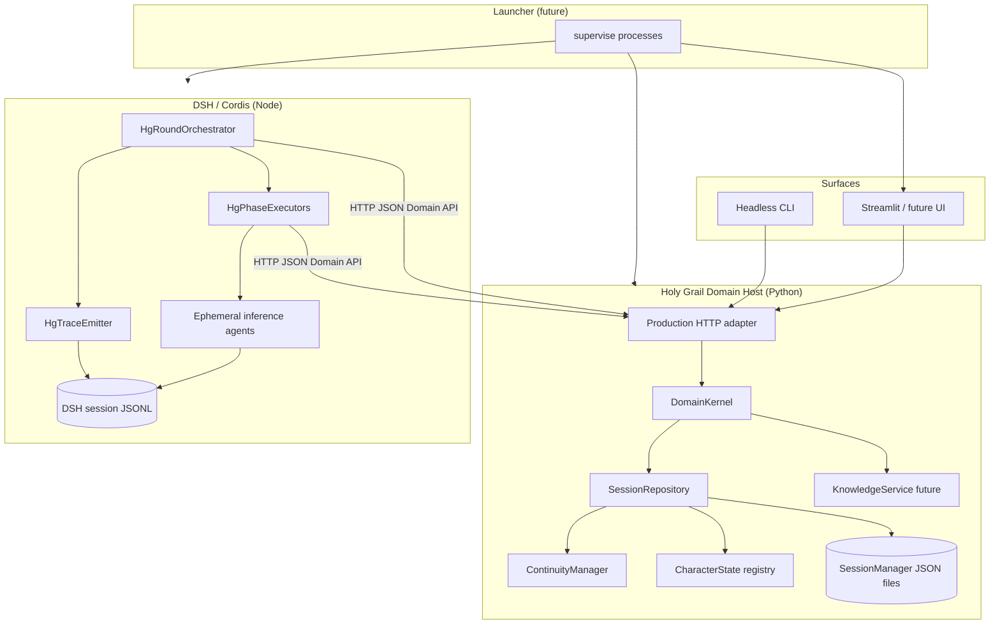

# V2 Production Domain Boundary — M5 Investigation Report

**Status:** Investigation complete (design only — no implementation authorized)  
**Date:** 2026-08-17  
**Architecture anchor:** `2ee410321f19e57c4579821ce590f701ccf2eedf`  
**Mature architecture anchor:** `8cd68d4`  
**M4 HgRoundOrchestrator anchor:** `cfd2f05`  
**Investigation HEAD:** `cfd2f05`

**Governing principle:**

> Holy Grail determines what is true. DeepSeek Harness records what happened.

**Implementation authorization:** None for this slice. Do not replace HTTP transport, FixtureStore, or introduce production persistence until Governance reviews the next slice.

---

## 1. Activation / bootstrap state

| Field | Value |
|-------|-------|
| Repository | `KizzieFae/Holy-Grail-RP-DeepSeek-Harness` |
| Branch | `main` |
| HEAD | `cfd2f05` |
| `origin/main` | aligned (`cfd2f052377c1115e2ec30d3beba566b06fcfdb3`) |
| Working tree | clean at investigation start |
| Assigned workflow weight | standard |
| Effective workflow weight | **full** |
| Bootstrap profile | full V2 architecture/boundary investigation |

**M1–M4 governance records (verified):**

| Milestone | Record | Anchor |
|-----------|--------|--------|
| M1 HgContextBridge | `v2-hg-context-bridge.md` | `50715d1` |
| M2 HgPhaseExecutors | `v2-phase-executors.md` | `4f3e135` |
| M3 HgTraceEmitter | `v2-hg-trace-emitter.md` | `8a6aade` |
| M4 HgRoundOrchestrator | `v2-hg-round-orchestrator.md` | `cfd2f05` |

**Validated test baseline (investigation HEAD):**

| Suite | Command | Result |
|-------|---------|--------|
| V2 Python | `pytest v2/tests -q` | **37 passed** |
| V2 Node | `cd v2/rp_runtime && npm test` | **30 passed** (incl. live DeepSeek single-inference + real full round) |

---

## 2. Current transitional boundary (HTTP + FixtureStore)

### Layer separation

| Layer | Location | Classification |
|-------|----------|----------------|
| **Domain API contract** | `v2/domain_api/contract.py` | **Permanent** — transport-neutral request/response types |
| **Domain kernel** | `v2/domain_api/kernel.py` | **Permanent** — authoritative prepare/validate/commit via `ContinuityManager` |
| **Participation policy** | `v2/domain_api/participation_policy.py` | **Permanent** |
| **Prototype HTTP transport** | `v2/domain_api/http_transport.py` | **Transitional** — `ThreadingHTTPServer`, JSON POST |
| **Prototype FixtureStore** | `v2/domain_api/fixture_store.py` | **Transitional** — in-memory `dict[str, SceneFixture]` |
| **DSH HTTP client** | `v2/rp_runtime/src/lib/domain-api-client.mjs` | **Transitional** — thin `fetch` wrapper + metrics |
| **Round orchestration** | `HgRoundOrchestrator.runRound()` | **Permanent** — calls Domain API; does not own truth |

### HTTP server (`http_transport.py`)

- **Implementation:** Python `ThreadingHTTPServer` + `BaseHTTPRequestHandler`
- **Serialization:** JSON request/response bodies (`Content-Type: application/json`)
- **Lifecycle:** Started via `python -m domain_api --host 127.0.0.1 --port <port>`; tests spawn per-suite subprocess and `kill()` on teardown
- **Error handling:** `KeyError`/`ValueError` → 400 JSON; unknown path → 404

### HTTP client (`domain-api-client.mjs`)

- **Implementation:** Node `fetch` to `baseUrl`
- **Metrics:** `trackBoundaryCall(metrics, label, body)` records label + request body per call; returned as `boundary_metrics` from `runRound()`

### Endpoints (prototype HTTP mapping)

| Method | Path | Kernel operation |
|--------|------|------------------|
| POST | `/v1/scenes` | `create_scene()` → `scene_snapshot()` |
| GET | `/v1/scenes/{id}/state` | `scene_snapshot()` |
| POST | `/v1/rounds/start` | `start_round()` |
| POST | `/v1/rounds/eligible-actors` | `eligible_actors()` |
| POST | `/v1/rounds/participation-decision` | `participation_decision()` |
| POST | `/v1/director/context/prepare` | `prepare_director_context()` |
| POST | `/v1/director/decisions/validate` | `validate_director_decision()` |
| POST | `/v1/context/prepare` | `prepare_context()` |
| POST | `/v1/moves/validate` | `validate_move()` |
| POST | `/v1/moves/commit` | `commit_move()` |
| POST | `/v1/narrator/context/prepare` | `prepare_narrator_context()` |

### FixtureStore ownership

`FixtureStore` holds `SceneFixture` objects:

```text
SceneFixture
  ├── hg_scene_id
  ├── manager: ContinuityManager          ← real V1 continuity engine
  ├── cast: list[str]
  ├── committed_move_count, commit_ids
  ├── character_private_secrets           ← prototype-only test secrets
  └── rounds: list[RoundFixture]          ← prototype round tracking
        ├── hg_round_id, eligibility_epoch
        ├── director_decision, character_turns
        └── actors_used_this_round, spotlight_history
```

**Prototype-only state (not production):**

- `character_private_secrets` — synthetic per-character secrets for isolation tests
- `RoundFixture` eligibility epoch / spotlight history — round orchestration metadata currently colocated with scene fixture
- `create_prototype_scene()` — hardcoded Workshop location, synthetic opener, `finalize_continuity_setup_seam`
- No disk persistence; process exit loses all scenes

**Real authoritative path inside prototype:**

- `commit_move()` → `ContinuityManager.process_turn()` — same commit authority as V1
- Context prepare → V1 `prompt_builders`, perception, validation modules
- Validation → `validate_bot_response`, `parse_character_move`, `parse_director_decision`

### Scene creation flow (V2 today)

1. DSH `runRound()` calls `api.createScene({ cast })` if no `hgSceneId` provided
2. HTTP POST `/v1/scenes` → `FixtureStore.create_scene()` → fresh `ContinuityManager`
3. DSH creates Cordis scene session `SessionId('hg-scene-${hgSceneId}')` for trace only
4. Round loop uses `hg_scene_id` + `hg_round_id` on every Domain API call

---

## 3. Real Holy Grail persistence / domain architecture

### Authoritative session representation (V1 production path)

V1 persists RP sessions via `SessionManager` (`autogen_rp/python/rp_app/session_manager.py`):

- **Storage:** `autogen_rp/python/data/sessions/{session_id}.json` + `_session_index.json`
- **Session file shape:**
  - `session_id`, `saved_at`, `characters`, `team_state`, `player_character`, `chat_history`
  - `metadata.character_states` — `CharacterState.to_dict()` per character
  - `metadata.continuity_state` — `ContinuityManager.to_dict()` (full continuity serialization)
  - `metadata.memory_buckets`, `scene_grounding`, `scene_template_id`, `scene_role_assignments`, audit fields

**Save path:** `session_lifecycle_save.save_current_session()` gathers Streamlit session state, calls `SessionManager.save_session()`.

**Load path:** `session_lifecycle_load` restores `character_states`, `ContinuityManager.from_dict()`, re-seeds canon anchors, rebuilds scene grounding.

### ContinuityManager (authoritative narrative truth)

`ContinuityManager` (`continuity_manager.py`) owns:

| Concern | In-memory representation |
|---------|--------------------------|
| Scene | `scene_state: SceneState` (location, presence, tension, roles) |
| Issues | `issues: dict[str, IssueState]` |
| Public events | `public_events: list[PublicEvent]` |
| Interpretations | `interpretations: dict[str, list[CharacterInterpretation]]` |
| Canon | `canon_anchors`, `summary_blocks`, `resolved_outcomes` |
| Turns | `turn_counter`, `turn_metadata_by_index` |
| Excursions | `excursions: dict[str, ExcursionRecord]` |

**Commit authority:** `process_turn()` is documented as the sole runtime commit path for narrative state.

**Serialization:** `to_dict()` / `from_dict()` via `serialize_manager_state` / `restore_manager_state` — production-grade round-trip used in V1 save/load.

### CharacterState

- Lives in V1 as `st.session_state["character_states"]` during runtime
- Serialized in session metadata; includes relationships, personality, knowledge boundaries
- **Not** currently loaded by V2 Domain API — FixtureStore uses synthetic `character_private_secrets` instead

### Relationships, memory, knowledge

- **Relationships:** embedded in `CharacterState`; cross-session promotion via `cross_session_memory_policy`
- **Memory buckets:** built at save time from continuity + chat history (`build_memory_buckets_fn`)
- **Knowledge/retrieval:** V1 has authored-source retrieval; vectors/graph/DB are future (`KnowledgeService` direction in architecture docs)
- Knowledge propagation on commit: `ContinuityManager.propagate_knowledge_from_turn()`

### Session IDs

- V1 `session_id` — opaque UUID, durable file key
- V2 `hg_scene_id` — UUID generated at prototype scene creation; **not** yet tied to V1 session files

### Headless vs UI

- **V1 UI:** Streamlit holds live objects in `st.session_state`; persistence is explicit save/load
- **V2 target:** Domain Host holds live authoritative objects; UI/CLI/DSH are consumers — **do not** make Streamlit session state the production authority

### V1 concepts that survive semantically into V2

| Survive | Retire as application plumbing |
|---------|----------------------------------|
| `ContinuityManager` + `process_turn` | Streamlit `st.session_state` as authority |
| `CharacterState` + relationships | AutoGen `team_state` as domain truth |
| `SessionManager` file persistence | Turn-runner inline orchestration in UI |
| Scene grounding, perception projection | V1 monolithic turn_runner control flow |
| Session index + metadata | Audit label coupling to session UUID |

---

## 4. Production domain-host requirements

The authoritative Python side should become an explicit **Holy Grail Domain Host** — a long-lived application boundary, not a collection of functions invoked ad hoc from DSH.

### Responsibilities (production)

```text
Holy Grail Domain Host
  ├── session lifecycle (create / open / resume / close)
  ├── scene lifecycle (within session)
  ├── continuity (ContinuityManager live instances)
  ├── character state (CharacterState registry)
  ├── validation (moves, director decisions)
  ├── eligibility + participation policy
  ├── context assembly (manifest projection)
  ├── knowledge/memory services (future DB/vector/graph behind same host)
  ├── persistence (synchronous commit + durable write)
  └── domain audit (correlatable with DSH execution evidence)
```

### Consumers (same host, no duplicated state)

- Streamlit / future UI
- Headless CLI
- DSH/Cordis runtime (`HgRoundOrchestrator` + phase executors)
- Future external APIs

### Non-goals

- DSH must not own continuity truth
- FixtureStore must not become a second production model
- Transport choice must not drive contract redesign

---

## 5. Boundary options (A–H)

### Option A — Production localhost HTTP service (recommended)

Python Domain Host as long-lived local HTTP/JSON service. Replace prototype `http_transport.py` with production server (structured logging, health, graceful shutdown, session open/resume endpoints) while **keeping the Domain API contract**.

| Criterion | Assessment |
|-----------|------------|
| Simplicity | High — already validated end-to-end |
| Process isolation | Strong — Python crash does not take down DSH |
| Restart behavior | Host reloads persistence; DSH reconnects by `hg_session_id` |
| Debugging | Excellent — curl, browser, structured logs |
| Latency | ~7–15+ calls/round on localhost; no demonstrated bottleneck |
| Windows | Reliable — localhost HTTP well-supported |
| Serialization | JSON — acceptable for manifest sizes today |
| State ownership | Clear — Python host owns all authoritative objects |
| Testability | Spawn host in tests (current pattern scales) |
| Deployment | Launcher starts host on fixed/ephemeral port |

### Option B — gRPC domain service

Same service boundary with protobuf + HTTP/2.

| Criterion | Assessment |
|-----------|------------|
| Benefits | Typed stubs, binary payloads, streaming |
| Costs | Codegen pipeline, harder manual debugging, two-language contract maintenance |
| Verdict | **Not justified** for local single-operator workload; revisit only if cross-machine or very large manifests |

### Option C — Named pipe / local IPC

Windows named pipes or domain sockets.

| Criterion | Assessment |
|-----------|------------|
| Benefits | Lower overhead than HTTP |
| Costs | Platform-specific tooling, poorer ecosystem for ad hoc inspection |
| Verdict | Marginal win over localhost HTTP; not worth bespoke protocol |

### Option D — DSH spawns Python over stdio/RPC

DSH owns Python child process lifecycle.

| Criterion | Assessment |
|-----------|------------|
| Benefits | Single parent process from user perspective |
| Costs | DSH restart kills domain state unless persistence reload is flawless; harder multi-client (UI + DSH); stderr/stdio coupling |
| Verdict | **Reject** as primary architecture — couples orchestration process to domain process ownership |

### Option E — Python spawns DSH worker

Python remains top-level host.

| Criterion | Assessment |
|-----------|------------|
| Conflict | Contradicts M4 mature design — DSH-native `HgRoundOrchestrator` is permanent orchestration home |
| Verdict | **Reject** — inverts validated architecture |

### Option F — In-process Python embedding from Node

`node-python`, `python-shell`, or native embedding.

| Criterion | Assessment |
|-----------|------------|
| Reality | No supported, maintainable Holy Grail embedding path exists today |
| Costs | Interpreter lifecycle, GIL, build tooling, crash blast radius, Windows packaging |
| Verdict | **Reject** — architectural cost exceeds localhost IPC |

### Option G — Progressive domain re-expression into TypeScript

Port continuity logic to TypeScript over time.

| Criterion | Assessment |
|-----------|------------|
| Scope | Long-term alternative only |
| Risk | 1300+ behavioral tests encode Python semantics; premature port duplicates truth |
| Verdict | **Not** a boundary replacement strategy — Python kernel remains authoritative |

### Option H — Domain Host + session repository (refinement of A)

Explicit production packaging:

```text
hg-domain-host (Python process)
  ├── DomainKernel (stateless operations)
  ├── SessionRepository (replaces FixtureStore)
  │     └── SessionManager + live ContinuityManager/CharacterState cache
  ├── Production HTTP adapter (replaces http_transport.py)
  └── optional CLI/UI in-process adapters (same kernel)
```

**Verdict:** This is the **preferred concrete form** of Option A.

---

## 6. Turn-level interaction analysis

### Validated round sequence

```text
eligibility → participation → Director → Character context → validation → commit → Narrator context → next actor
```

### Boundary calls per round (measured)

| Scenario | Calls | Evidence |
|----------|-------|----------|
| Single-character round | ≥ 7 | `director-character-round.test.mjs` |
| Labels observed | `getEligibleActors`, `getParticipationDecision`, `prepareDirectorContext`, `validateDirectorDecision`, `prepareCharacterContext`, `validateMove`, `commitMove`, `prepareNarratorContext` | same |
| Per additional character turn | +~5–7 (eligibility refresh, character path, optional narrator) | orchestrator loop structure |
| Two-character typical round | ~12–18 | extrapolated from loop (2× character path + shared director) |

### Payload characteristics

| Operation | Size driver | Sync? |
|-----------|-------------|-------|
| `prepare*Context` | Manifest contributions (text blocks) | Yes — blocks inference |
| `validate*` | Structured JSON move/decision | Yes |
| `commitMove` | Move + director decision + anchors | Yes — **transaction boundary** |
| `getEligibleActors` | Small projection | Yes |

### Transaction boundaries

1. **Proposal / inference** — DSH-only; no continuity mutation (`record_uncommitted_proposal` is explicit no-op)
2. **Validation** — read-only on continuity; may reject
3. **Commit** — `process_turn()` mutates continuity; must align with persistence write
4. **Narrator** — presentation; after commit; failure does not roll back canon (validated in tests)

### Error propagation

- HTTP 4xx/5xx → DSH throws; round aborts or retries per phase policy
- `CommitResponse.committed=false` → anchor mismatch; DSH records failure, no narrator

### Process restart mid-round

| Failure | Behavior |
|---------|----------|
| DSH restart | Reload HG session by durable `hg_session_id`; resume or abandon in-flight inference; execution evidence in DSH session log may be partial |
| Python host restart | Reload persisted session; `expected_turn_index` + `domain_commit_id` prevent double-commit on retry |

---

## 7. Session lifecycle design (production)

### Identity model

| ID | Owner | Durability | Purpose |
|----|-------|------------|---------|
| `hg_session_id` | Domain Host | **Durable** (file key) | Authoritative RP session |
| `hg_scene_id` | Domain Host | Durable within session | Active scene continuity scope (may equal session in v1 parity) |
| `hg_round_id` | Domain Host | Ephemeral per round | Round-scoped eligibility/participation |
| `domain_commit_id` | Domain Host | Durable after commit | Idempotency + audit correlation |
| `dsh_session_id` / inference `SessionId` | DSH | Durable in DSH JSONL | Execution evidence only |

### Lifecycle

```text
UI / CLI / DSH
    ↓
POST /v1/sessions/create  OR  POST /v1/sessions/open { hg_session_id }
    ↓
Domain Host loads/creates ContinuityManager + CharacterStates
    ↓
Returns hg_session_id, hg_scene_id, turn_index
    ↓
HgRoundOrchestrator.runRound({ hgSceneId, ... })  — correlates execution
    ↓
On commit success: Domain Host persists before returning committed=true
```

### Answers

| Question | Answer |
|----------|--------|
| Who creates a session? | Domain Host on explicit create/open API (any consumer) |
| Who loads persistence? | Domain Host via `SessionRepository` → `SessionManager` |
| Who keeps live authoritative state? | Domain Host in-memory cache backed by persistence |
| DSH restart? | Reconnect with `hg_session_id`; DSH execution sessions are new; correlate via IDs in `hg/*` events |
| Python host restart? | Reload session from disk; in-flight uncommitted proposals lost (correct) |
| Re-association? | `hg_scene_id` + `hg_session_id` in DSH trace payloads — never merge stores |
| Durable IDs? | `hg_session_id`, `domain_commit_id`, `continuity_turn_index` |
| Durable execution evidence? | DSH session JSONL only |

---

## 8. FixtureStore retirement map

| FixtureStore responsibility | Production replacement |
|------------------------------|------------------------|
| In-memory scene dict | `SessionRepository` — keyed by `hg_session_id` / `hg_scene_id` |
| `ContinuityManager` instance | Live object in repository; hydrated from `metadata.continuity_state` |
| `create_prototype_scene()` | `SessionLifecycle.create_scene()` — real cast/cards/opener from config |
| `character_private_secrets` | `CharacterState` private knowledge fields |
| `RoundFixture` tracking | `RoundRegistry` in Domain Host (or session metadata) — not in DSH |
| `eligibility_epoch` | Remains domain-side round state |
| `committed_move_count` / `commit_ids` | Derived from continuity + commit log |
| Test-only fixtures | Narrow `TestFixtureStore` or in-memory repository for unit tests only |

**End state:** FixtureStore deleted from production path; optionally retained as test helper behind repository interface.

---

## 9. Domain API contract assessment

| Contract | Verdict |
|----------|---------|
| `ContextPrepareRequest` / `PromptContributionManifest` | **Keep** — core projection contract |
| `DirectorContextPrepareRequest` | **Keep** |
| `NarratorContextPrepareRequest` | **Keep** |
| `ValidationRequest` / `ValidationResponse` | **Keep** |
| `CommitRequest` / `CommitResponse` | **Refine** — add optional `idempotency_key` / explicit `domain_commit_id` on retry |
| `RoundStartRequest` / `RoundStartResponse` | **Keep** |
| `EligibleActorsRequest` / `EligibleActorsResponse` | **Keep** — `eligibility_snapshot_id` essential |
| `ParticipationDecisionRequest` / `ParticipationDecision` | **Keep** |
| `DirectorDecisionValidationRequest` / `DirectorDecisionResult` | **Keep** |
| `SceneStateSnapshot` | **Refine** — add `hg_session_id`, `continuity_version` |
| `POST /v1/scenes` (prototype) | **Split** → `sessions/create`, `sessions/open`, `scenes/activate` |
| `record_uncommitted_proposal` | **Retire** as public API — implicit by absence of commit |

Transport change must **not** force contract redesign beyond session identity refinements above.

---

## 10. Persistence / commit semantics

### Required invariant

```text
model proposal → validation → authoritative commit → durable persistence
```

### Production rules

| Rule | Specification |
|------|---------------|
| `commit_move` sync with persistence | **Yes** — `committed=true` implies durability on return (same transaction) |
| Successful Domain API commit | Guarantees continuity mutation **and** persisted session file update |
| Persistence lag | **Not allowed** for commit success path |
| Persistence failure after validation | Return `committed=false`, `validation_class=continuity_anchor` or new `persistence_error`; continuity not advanced |
| DSH records failure | `hg/move-rejected` or `hg/commit-failed` with reason |
| Retries | Safe when keyed by `domain_commit_id` / idempotency token — replay returns same result |
| Stale checks | `expected_turn_index` (continuity anchor) + `eligibility_snapshot_id` (participation) |

### Idempotency

- Client may retry `commitMove` with same `inference_id` + `expected_turn_index` + content hash
- Server stores recent commit outcomes keyed by `domain_commit_id` or dedup key (short TTL acceptable)

---

## 11. Concurrency / staleness model

Designed for **single operator, single active scene** today; prevent obvious corruption:

| Hazard | Mitigation |
|--------|------------|
| Concurrent commits | Serialize per `hg_scene_id` in Domain Host (mutex/actor queue) |
| Duplicate `commitMove` | Idempotency key / `domain_commit_id` replay |
| Stale `eligibility_snapshot_id` | Reject participation/director validation with retryable error |
| Stale `expected_turn_index` | `CommitResponse.committed=false` (already implemented) |
| Timeout retry | Client refreshes eligibility snapshot before retry |
| Process reconnect | Open session returns current `turn_index` + version |
| Multiple scenes | Supported via separate `hg_scene_id` entries in repository |

No distributed locking, leader election, or multi-master replication required.

---

## 12. Windows / deployment analysis

| Concern | Production approach |
|---------|---------------------|
| Startup reliability | Launcher starts `hg-domain-host` first; health check `GET /health` |
| Subprocess handling | Domain Host independent of DSH — avoids DSH killing Python |
| Localhost networking | Bind `127.0.0.1`; configurable port; env `HG_DOMAIN_HOST_URL` |
| Port conflicts | Retry alternate port or read from lockfile written by launcher |
| Named pipes | Not required if HTTP selected |
| Process cleanup | Launcher supervises both; on exit, flush persistence then stop |
| Debugging | HTTP + Python logs + DSH `hg/*` trace |
| Packaging | Single user install: Python venv + Node runtime; both bundled |
| User experience | One launcher action — user does not open two consoles manually |

### Desired launch architecture

```text
holy-grail-launcher (future)
  ├── start hg-domain-host (Python, 127.0.0.1:PORT)
  ├── wait for /health
  ├── start DSH/Cordis RP runtime (reads HG_DOMAIN_HOST_URL)
  └── start UI (Streamlit or embedded shell) — optional third process
```

---

## 13. Future database / knowledge compatibility

```text
Python KnowledgeService
  ├── relational database
  ├── vector index
  ├── graph store
  └── authored sources
```

**Long-lived Python Domain Host favors this evolution:**

- DSH sends scene/character IDs + query intent via Domain API
- Retrieval, ranking, and authority classification stay Python-side
- Vectors/DB can change without DSH transport or contract churn
- Commit path still flows through `ContinuityManager` — retrieval remains non-authoritative

---

## 14. DSH / domain session relationship

```text
HG domain session / scene  = authoritative state identity
DSH scene session          = execution evidence identity
```

| Aspect | HG Domain | DSH |
|--------|-----------|-----|
| Continuity truth | Yes | No |
| Inference transcripts | No | Yes |
| `hg/move-committed` | Emitted by DSH, keyed by `domain_commit_id` from HG | Stored in JSONL |
| Resume | `sessions/open` | `agentLoop` creates new inference sessions |
| Correlation | `hg_session_id`, `hg_scene_id`, `hg_round_id`, `inference_id`, `domain_commit_id` in both directions | Same fields in `HgTraceEmitter` payloads |

**Do not merge** DSH session store with HG session store.

---

## 15. Decision matrix

| Option | Clean V2 | State clarity | Windows | Debug | Multi-surface | Knowledge future | Migration cost | Score |
|--------|----------|---------------|---------|-------|---------------|------------------|----------------|-------|
| A/H HTTP Domain Host | High | High | High | High | High | High | Medium | **Preferred** |
| B gRPC | High | High | Medium | Medium | High | High | High | Secondary |
| C Named pipe | Medium | High | Medium | Low | Medium | High | High | Reject |
| D DSH-spawned Python | Low | Medium | Medium | Medium | Low | Medium | Medium | Reject |
| E Python-spawned DSH | Low | Low | Medium | Medium | Low | Medium | High | Reject |
| F In-process embed | Low | Low | Low | Low | Low | Low | Very high | Reject |
| G TS re-expression | Medium | Low | High | High | High | Low | Very high | Long-term only |

---

## 16. Preferred production architecture

### Answers

1. **Authoritative domain state:** Python **Holy Grail Domain Host** process
2. **DSH orchestration:** DSH/Cordis process (`HgRoundOrchestrator`, `HgPhaseExecutors`, inference substrate)
3. **Transport:** **localhost HTTP/JSON** — intentional production boundary (not prototype server code)
4. **Start/stop:** Future launcher starts Domain Host first, then DSH runtime, then optional UI
5. **Persistent state:** `SessionManager` files under user data dir (`continuity_state` + `character_states` in metadata)
6. **Commit success guarantee:** `committed=true` ⟺ `process_turn` applied ⟺ session file flushed
7. **Session resume:** `sessions/open { hg_session_id }` on Domain Host
8. **DSH correlation:** `hg_session_id` / `hg_scene_id` / `domain_commit_id` on all `hg/*` events and Domain API calls
9. **Knowledge layer:** Behind Domain Host; context prepare endpoints call KnowledgeService internally
10. **FixtureStore:** Retired → `SessionRepository`; test-only fixture helper if needed
11. **Current HTTP code:** Replace `http_transport.py` with production adapter; keep routes/contract stable
12. **Remains Python:** Continuity, validation, participation, context assembly, persistence, knowledge
13. **Remains TypeScript:** Round orchestration, inference execution, trace emission, provider adapters

### Process / data-flow diagram



---

## 17. Clean-V2 retirement implications

Under the chosen design, the following **disappear** from production:

| Artifact | Fate |
|----------|------|
| `fixture_store.py` as production store | Replaced by `SessionRepository` |
| `create_prototype_scene()` in production path | Replaced by real session/scene lifecycle |
| Prototype `http_transport.py` | Replaced by production Domain Host HTTP module |
| Migration-only scene creation in `runRound()` default | Orchestrator requires explicit session or configured create |
| Streamlit as runtime authority | UI becomes consumer of Domain Host |
| Duplicate V1 state in DSH | Never introduced |
| `character_private_secrets` synthetic map | Real CharacterState private fields |

**Stays (refined, not discarded):**

- `contract.py` — transport-neutral contract
- `kernel.py` — domain operations (injected repository instead of FixtureStore)
- `domain-api-client.mjs` — becomes thin client over stable production URL (transport abstraction optional)

---

## 18. Challenge / refinement pass

| Challenge | Response |
|-----------|----------|
| Replacing HTTP because in-process sounds cleaner? | **No** — in-process embedding rejected on cost; HTTP is intentional |
| Unnecessary process complexity? | Two processes (Host + DSH) match separation of truth vs execution; launcher hides ops |
| Python Domain Host becoming monolith? | Bounded monolith — correct place for domain; DSH stays orchestration-only |
| State ownership obvious? | Yes — Python Host = truth; DSH JSONL = evidence |
| DSH restart safe? | Yes with durable `hg_session_id` + idempotent commit |
| Python restart safe? | Yes with persistence reload; uncommitted proposals lost |
| UI/CLI share domain services? | Yes — same HTTP API |
| Database/vector layer fits? | Yes — behind Host, invisible to DSH |
| Commits durable/idempotent? | Required refinement — sync persist + dedup keys |
| Easy to debug? | HTTP + dual trace streams |
| Windows practical? | Yes — localhost HTTP proven in tests |
| Reduces migration clutter? | Retires FixtureStore and prototype transport |
| Path to remove V1 runtime code? | Domain Host extracts session lifecycle from Streamlit coupling |

**Refinement:** Prefer **Option H** naming — production Domain Host with SessionRepository — over vague "keep HTTP prototype."

---

## 19. Architecture verdict

**Verdict: production domain boundary established**

The production architecture is:

> **Long-lived Python Holy Grail Domain Host + localhost HTTP/JSON Domain API + DSH-native orchestration**, with `SessionRepository` replacing `FixtureStore` and synchronous commit-to-persistence semantics.

**One focused unresolved question for implementation slice:**

> Exact session file layout versioning and `hg_session_id` ↔ `hg_scene_id` cardinality (1:1 for initial parity vs multi-scene-per-session) — recommend **1:1** for first production slice matching V1 `session_id`.

---

## 20. Repository state

| Field | Value |
|-------|-------|
| Investigation doc | `governance/rp-app/v2-production-domain-boundary.md` |
| Implementation changes | None (investigation only) |
| Commit | (recorded after push) |

---

## 21. Next recommended implementation slice

**Slice M5.1 — SessionRepository + production Domain Host skeleton (no DSH default path change)**

Exactly one slice — **not authorized until Governance review:**

1. Introduce `SessionRepository` wrapping `SessionManager` + live `ContinuityManager`/`CharacterState` cache
2. Inject repository into `DomainKernel` (replace direct `FixtureStore` dependency)
3. Add Domain API endpoints: `sessions/create`, `sessions/open`, `GET /health`
4. Implement **synchronous persist on `commit_move` success** via repository
5. Keep existing round endpoints behavior-compatible for tests
6. Retain prototype HTTP server for one transition commit OR swap to `hg_domain_host/` package with same routes
7. Add Python tests proving: commit survives host restart (reload session, continuity matches)
8. **Do not** change DSH `runRound()` default create path until repository tests pass

**Explicitly out of scope for M5.1:** launcher, gRPC, in-process embedding, V1 Streamlit rewiring, knowledge DB.

---

## References

- `v2/domain_api/contract.py`, `kernel.py`, `fixture_store.py`, `http_transport.py`
- `v2/rp_runtime/src/lib/domain-api-client.mjs`
- `v2/rp_runtime/src/plugins/hg-round-orchestrator/service.mjs`
- `autogen_rp/python/rp_app/session_manager.py`, `session_lifecycle_save.py`, `session_lifecycle_load.py`
- `autogen_rp/python/rp_app/continuity_manager.py`
- `governance/rp-app/v2-boundary-prototype.md`, `v2-runtime-boundary-decision.md`, `v2-mature-plugin-architecture.md`
