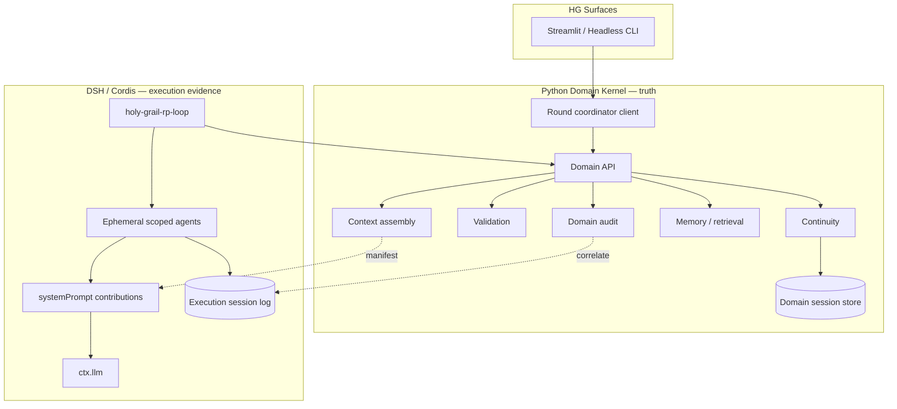

# Holy Grail V2 — Runtime Boundary & Session Topology Decision

**Status:** Architecture decision proposal (full-weight consensus loop — investigation only)  
**Date:** 2026-03-17  
**Baseline anchor:** `12489a93146c9673a66518d7b3cc2a3ec02fba3b`  
**DSH evaluated:** `@deepseek-ai/dsh@0.1.0-rc.7`, `@deepseek-ai/cordis@4.0.1` (npm registry)  
**Implementation authorization:** boundary prototype slice completed — see `v2-boundary-prototype.md`

**Governing principle (unchanged):**

> Holy Grail determines what is true. DeepSeek Harness records what happened.

---

## 1. Activation / bootstrap verification

| Field | Value |
|-------|-------|
| Repository | `KizzieFae/Holy-Grail-RP-DeepSeek-Harness` |
| Branch | `main` |
| HEAD at investigation start | `12489a93146c9673a66518d7b3cc2a3ec02fba3b` |
| `origin/main` | aligned |
| Working tree | clean |
| Assigned workflow weight | standard |
| Effective workflow weight | **full** (architecture-sensitive escalation) |
| Bootstrap profile | full V2 architecture/bootstrap |

**Full bootstrap reads completed:** `v2-dsh-replatforming-authority.md`, `v2-capability-dsh-mapping.md`, `v2-behavioral-evidence-inventory.md`, `CHECKPOINT_BASELINE_DSH.md`, `ARCHITECTURE_OVERVIEW.md`, `autogen_rp/python/rp_app/ARCHITECTURE.md`, `docs/issue-bootstrap-profiles.md` (Full profile), DSH primary sources (below).

---

## 2. DSH revision and primary sources

| Source | Revision / location |
|--------|---------------------|
| npm `@deepseek-ai/dsh` | `0.1.0-rc.7` |
| npm `@deepseek-ai/cordis` | `4.0.1` |
| Upstream repo | https://github.com/deepseek-ai/deepseek-harness |
| Architecture index | https://deepseek-harness.github.io/deepseek-harness/en/reference/ |
| Core / agent / session | `…/reference/subsystems/core`, `session`, `persistence` |
| Agent lifecycle | `…/reference/agent-lifecycle` |
| Plugins & lifecycle | `…/develop/framework/` |
| Services & events | `…/develop/framework/service`, `…/develop/framework/events` |
| System prompt | `…/reference/subsystems/system-prompt` |
| Subagents | `…/reference/subsystems/subagent` |
| Python SDK | `…/guide/python-sdk` |
| Persistence catalog | `…/reference/persistence-catalog` |

**DSH facts verified (2026-03-17):**

- **Session** = append-only `SessionEvent` log; LLM message history is **derived**, never authoritative storage ([session subsystem](https://deepseek-harness.github.io/deepseek-harness/en/reference/subsystems/session)).
- **Agent loop** is swappable; extensions depend on `agent`, not `agent-loop` ([core](https://deepseek-harness.github.io/deepseek-harness/en/reference/subsystems/core)).
- **`ctx.agents.create()` / `resume()`** each bind an agent to a session; scoped registration via `agent.ctx` ([core](https://deepseek-harness.github.io/deepseek-harness/en/reference/subsystems/core)).
- **`agent/pre-step`** waterfall is authoritative before request derivation; supports interception/replacement ([agent-lifecycle](https://deepseek-harness.github.io/deepseek-harness/en/reference/agent-lifecycle)).
- **`agent.inject()`** queues model-visible context for next admitted request ([core](https://deepseek-harness.github.io/deepseek-harness/en/reference/subsystems/core)).
- **`ctx.systemPrompt.section()` / `.context()`** support scoped, ordered contributions with `system-prompt/assemble` waterfall ([system-prompt](https://deepseek-harness.github.io/deepseek-harness/en/reference/subsystems/system-prompt)).
- **`ctx.sessionPersistence`** provides durable append-only JSONL storage ([persistence](https://deepseek-harness.github.io/deepseek-harness/en/reference/subsystems/persistence)).
- **Subagents** are model-initiated delegated agents in separate child sessions — not role slots ([subagent](https://deepseek-harness.github.io/deepseek-harness/en/reference/subsystems/subagent)).
- **Python SDK** (`deepseek-harness-sdk`) bundles the Node runtime; supports custom `cordis.yml` compositions ([python-sdk](https://deepseek-harness.github.io/deepseek-harness/en/guide/python-sdk)).
- **Windows constraint (DSH fact):** shipped coding-agent compositions requiring persistent PTY/bash **do not support Windows agents** ([python-sdk](https://deepseek-harness.github.io/deepseek-harness/en/guide/python-sdk)). Holy Grail must use a **custom minimal composition** (no coding-agent tool surface).

---

## 3. Current architectural constraints (Holy Grail — behavioral, not V1 structure)

These are **requirements**, not arguments for preserving Python layout:

1. **Continuity authority (#224):** only `ContinuityManager` / `process_turn` commits world truth.
2. **Structured moves:** characters emit JSON contracts; validation before commit.
3. **Perception boundaries:** per-recipient projection; not parseable from narrator prose.
4. **Director-mediated rounds:** multi-actor orchestration with anti-repeat-in-cycle rules.
5. **Narrator presentation-only:** verbatim dialogue preservation; not continuity authority.
6. **Knowledge non-authority:** retrieval/vectors suggest; continuity decides truth.
7. **Session identity (#106/#109):** opaque UUID domain sessions separate from audit labels.
8. **Behavioral evidence:** 1361+ deterministic tests encode domain semantics — preservation matters.
9. **Headless/UI parity:** same turn semantics across Streamlit and simulation entrypoints.
10. **Inference reconstructability:** must answer what each model saw and why (audit + future DSH trace).

---

## 4. Boundary options evaluated

### Option A — Python domain + DSH as external inference/trace service

```text
HG Python (orchestration + domain) ──RPC/subprocess──► DSH (llm + session log) ──► model
```

**Assessment:** Viable only if DSH receives **rich lifecycle participation** (custom composition, log-only HG correlation events, per-inference scoped agents). As a thin `harness.run(prompt)` wrapper it **under-utilizes DSH** — equivalent to a complex OpenAI client. **Reject as primary architecture**; acceptable as a **degenerate subset** during early spike only.

### Option B — Python domain services + DSH owns RP runtime orchestration

```text
DSH custom RP loop ──domain API──► Python continuity/validation/context
```

**Assessment:** Correct **seam direction** if Python remains authoritative domain kernel. **Risk:** per-turn RPC chatter if loop naïvely calls Python for every micro-step. **Viable when batched** into coarse domain operations (see §6). **Partial fit** — orchestration logic may live in DSH; domain stays Python.

### Option C — Progressive native DSH re-expression

**Assessment:** Re-express **runtime-facing** orchestration, inference lifecycle, and trace in TypeScript/Cordis; **retain Python domain kernel** until continuity/porting is justified by evidence. **Not** a Big Bang rewrite. **Viable as phased strategy** layered on Option F (below).

### Option D — Full DSH-native runtime/domain

**Assessment:** Porting continuity, perception, validation, retrieval policy to TS **couples RP domain truth to DSH release cycle** and forfeits 1300+ Python tests as behavioral oracle. **Reject** for domain layer. DSH should not become the continuity database.

### Option E — Hybrid: DSH inference substrate + Python authoritative domain kernel (preferred)

```text
┌─────────────────────────────────────────────────────────────┐
│  Holy Grail surfaces (Streamlit, headless CLI, future API)   │
└────────────────────────────┬────────────────────────────────┘
                             │
┌────────────────────────────▼────────────────────────────────┐
│  Python Domain Kernel (authoritative)                        │
│  continuity · character state · validation rules · perception │
│  retrieval/memory · context assembly · domain session store   │
│  domain audit · commit transactions                           │
└────────────────────────────┬────────────────────────────────┘
                             │ Domain API (batched, typed)
┌────────────────────────────▼────────────────────────────────┐
│  DSH / Cordis Runtime                                        │
│  holy-grail-rp-loop plugin · ephemeral scoped agents         │
│  ctx.llm · session events · execution persistence           │
│  systemPrompt contributions (per inference)                   │
└────────────────────────────┬────────────────────────────────┘
                             │
                             ▼
                          LLM provider
```

**Assessment:** Best long-term balance. Uses DSH for what it is strong at (inference lifecycle, event-sourced execution trace, plugin composition, provider adapters). Keeps Holy Grail domain truth in Python where behavioral investment and tests live. **Recommended.**

### Option F — Python-hosted orchestrator driving DSH inference workers

Python `RoundOrchestrator` remains primary process; each model call spawns/addresses a DSH inference worker with fresh scoped agent + short-lived session slice.

**Assessment:** Lowest integration risk, but **orchestration stays outside DSH plugin model** — harder to gain Cordis lifecycle benefits. Useful **spike path** toward Option E, not the long-term end state.

---

## 5. Responsibility placement matrix

| Capability | Ideal owner | Classification | Rationale |
|------------|-------------|----------------|-----------|
| RP round orchestration | DSH `holy-grail-rp-loop` plugin | DSH-native | Multi-phase turn driver fits custom loop; benefits from `agent/*` events |
| Director inference | DSH scoped agent (ephemeral) | Split | HG builds Director prompt package; DSH executes + logs |
| Director selection semantics | Python domain | HG external | JSON contract + parsing rules are HG behavior |
| Character inference | DSH scoped agent (ephemeral) | Split | One inference ≠ one persistent character mind |
| Character move contract | Python domain | HG external | Validation + commit authority |
| Narrator inference | DSH scoped agent (ephemeral) | Split | Presentation-only model call |
| Validation / retry rules | Python domain | HG external | Domain semantics (presence, drift, proposals) |
| Retry loop ownership | DSH loop + Python gate | Split | Loop drives attempts; Python returns accept/reject + reason |
| Continuity / SceneState | Python domain | HG external | Authoritative truth (#224) |
| Character state | Python domain | HG external | Private per-character truth |
| Relationship state | Python domain | HG external | Domain truth |
| Perception projection | Python domain | HG external | Authoritative filter before model sees dialogue |
| Scene grounding | Python domain (derived) | HG external | Read model from continuity |
| Context construction | Python domain | HG external | Produces typed contributions + message list |
| Authored retrieval | Python domain | HG external | Selection/merge policy; storage behind interface |
| Episodic memory | Python domain | HG external | Commit-time writes; read path for prompts |
| Future vector/graph retrieval | Python domain (+ stores) | Language-neutral boundary | HG interface; storage swappable |
| Model/provider invocation | DSH `ctx.llm` | DSH-native | Adapter seam |
| Provider selection | DSH config (+ HG env bridge) | Split | DSH owns adapter routing |
| Transport/model retries | DSH | DSH-native | Context overflow, compaction ([agent-lifecycle](https://deepseek-harness.github.io/deepseek-harness/en/reference/agent-lifecycle)) |
| DSH trace / session events | DSH | DSH-native | Execution evidence |
| HG domain audit | Python domain | HG external | CTAR, continuity mirrors, retrieval summary |
| HG session/resume | Python domain store | HG external | Cast, scene setup, continuity snapshots |
| UI | Python Streamlit (initially) | HG external | External surface over domain API + runtime driver |
| Background consolidation workers | TBD | Requires further decision | Not V1 path; not DSH subagents by default |

---

## 6. Process / language boundary analysis

### Per-turn cross-boundary pattern (recommended batching)

For one user round with 3 bot characters:

| Phase | Boundary crossings | Payload |
|-------|-------------------|---------|
| Round open | 1× `begin_round` | scene id, user input, cast |
| Director | 1× `prepare_director_inference` + 1× `apply_director_result` | prompt contributions in / parsed JSON out |
| Each character | 1× `prepare_character_inference` + N× `validate_move` + 0–1× `commit_character_move` | contributions in; structured move out |
| Narrator (each) | 1× `prepare_narrator_inference` + 1× `record_narration` | render package in; prose out (observational) |
| Round close | 1× `finalize_round` | continuity snapshot handles |

**Estimated:** ~10–20 domain API calls per user round (not per validation rule). Acceptable for localhost IPC; batch further if profiling demands.

### Where IPC is appropriate

- Continuity reads/writes
- Validation adjudication
- Context assembly from authoritative stores
- Commit transactions

### Where IPC is pathological

- Per-field prompt string fetches
- Validation micro-rules as separate RPCs
- Continuity commit inside DSH session append handlers synchronously without transaction framing

### Turn lifecycle grouping (recommended)

**DSH owns:** inference attempt loop, provider errors, session event append, `pre-step` admission.  
**Python owns:** what the model should see, whether output is legal, what becomes canon.

```text
Director → context retrieval → character inference → validation → retry → Narrator → continuity commit → memory updates
         |________________________ DSH execution trace (all model I/O) ________________________|
         |____ Python domain gate (validate/commit) at character boundary ____|
         |____________ Python domain commit (single transaction) ____________|
```

---

## 7. Session topology comparison

| Topology | Verdict | Notes |
|----------|---------|-------|
| **Per HG scene** (one execution session) | **Recommended anchor** | Correlates full scene trace; use **scoped ephemeral agents** inside |
| Per HG character (persistent) | **Reject** | Cross-character context contamination; breaks perception model |
| Per role (persistent Director/character/Narrator) | **Reject** | Role history bleeds across beats; character "memory" is HG domain |
| Per RP round (new session) | **Partial** | Good for isolation; loses within-scene replay unless correlated |
| Per inference only | **Partial** | Maximum isolation; heavy correlation overhead |
| **Hybrid (recommended)** | **Adopt** | **One DSH execution session per HG scene** + **ephemeral scoped agent per inference** + **log-only `hg/*` correlation events** |

### Recommended session model

```text
HolyGrailScene (domain)
  session_id: UUID
  continuity state: Python store

DSH ExecutionSession (evidence)
  dsh_session_id: correlates 1:1 with HG scene for production
  events: append-only
    turn/start, step/*, assistant/message, request/header
    hg/round-started, hg/director-decision, hg/move-proposed,
    hg/move-rejected, hg/move-committed, hg/narration-rendered
    (hg/* are log-only — NOT SurfaceEventType)
```

**Rules:**

- DSH derived history contains **only the active inference's** scoped contributions.
- Character A's inference session surface must not include Character B's prior model context.
- HG `continuity_turn_index` appears on every `hg/*` event and domain audit row.
- DSH session resume replays **execution**, not **world state** — world state reloads from Python store.

---

## 8. Agent topology (distinct from session)

| Role | Representation | Persistence |
|------|----------------|-------------|
| **Director** | Ephemeral scoped agent per Director inference | Destroyed after parse |
| **Each character** | Ephemeral scoped agent per character attempt | Destroyed after validation outcome |
| **Narrator** | Ephemeral scoped agent per render call | Destroyed after prose returned |
| **Validator** | **Not an agent** — Python service | n/a |
| **RP loop driver** | Custom `holy-grail-rp-loop` Cordis plugin | Lives for scene lifetime |
| **DSH subagents** | **Not used** for HG roles | Subagents are model-delegation, not cast members |

**Rationale:** Holy Grail characters are not autonomous coding agents dispatching subtasks. Cast roles are **orchestrated inference slots** with HG-supplied context.

---

## 9. Context assembly design

**Recommended: Hybrid (HG produces typed contributions; DSH assembles per inference)**

1. Python `ContextAssembly` builds a **`PromptContributionManifest`** from continuity, character state, perception, grounding, retrieval, memory.
2. Each manifest entry carries: `contribution_id`, `source_kind`, `knowledge_ids[]`, `authority_class`, `text`, `scope` (director|character|narrator), `character_id?`.
3. DSH loop registers manifest entries via `agent.ctx.systemPrompt.context()` for **this inference only**.
4. DSH `request/header` event records assembled system prompt + tool schemas ([session](https://deepseek-harness.github.io/deepseek-harness/en/reference/subsystems/session)).
5. HG domain audit stores manifest hash + contribution ids; DSH stores full execution envelope.

**Not recommended:** HG sends final messages only with no contribution trace — loses provenance.  
**Not recommended:** DSH pulls field-by-field from Python during `pre-step` — too chatty.

---

## 10. Validation / commit transaction model

```text
model output (DSH session: assistant/message — PROPOSED)
    → parse (Python)
    → validate (Python)
    → if reject: DSH append hg/move-rejected (log-only) + retry if budget
    → if accept: Python continuity commit (TRANSACTION)
    → DSH append hg/move-committed (log-only, references continuity_turn_index)
    → Python memory epilogue (same transaction or post-commit hook)
    → narrator inference (observational — does not commit truth)
```

| Question | Answer |
|----------|--------|
| Who owns retry loop? | **DSH loop** enforces attempt budget; **Python** returns accept/reject |
| Where does validation execute? | **Python domain** |
| What does DSH log before acceptance? | Full model I/O + `hg/move-proposed` + optional `hg/move-rejected` |
| Rejected attempts in trace? | Yes — log-only events, excluded from HG canon |
| Successful → authoritative? | **Only** via Python `commit_character_move` |
| Prevent DSH history becoming canon? | No continuity reads from DSH surface; commit requires Python gate |
| Replay distinguish proposed vs committed? | Yes — `assistant/message` vs `hg/move-committed` linkage via `sourceEventSeqs` / correlation ids |

---

## 11. Architecture decision matrix (summary scores: 1=poor, 5=excellent)

| Criterion | A proxy | B naive | C phased | D full TS | **E hybrid** | F python-host |
|-----------|---------|---------|----------|-----------|--------------|---------------|
| Structural simplicity | 4 | 3 | 3 | 2 | **4** | 4 |
| Modularity | 2 | 4 | 4 | 3 | **5** | 3 |
| Runtime efficiency | 3 | 3 | 4 | 4 | **4** | 3 |
| Behavioral stability | 4 | 3 | 4 | 2 | **5** | 4 |
| State consistency | 4 | 4 | 4 | 3 | **5** | 5 |
| Observability | 2 | 4 | 4 | 4 | **5** | 3 |
| Inference reconstructability | 2 | 4 | 4 | 4 | **5** | 3 |
| RP domain isolation | 5 | 4 | 4 | 2 | **5** | 5 |
| Knowledge/vector future | 4 | 4 | 4 | 3 | **5** | 5 |
| Context isolation | 3 | 3 | 4 | 3 | **5** | 4 |
| Testability | 4 | 3 | 4 | 2 | **5** | 4 |
| Windows viability | 4 | 3 | 3 | 3 | **4*** | 4 |
| DSH capability utilization | 1 | 4 | 4 | 5 | **5** | 2 |
| Long-term maintainability | 3 | 4 | 4 | 2 | **5** | 3 |

\*Requires custom minimal Cordis composition without POSIX coding-agent tools.

---

## 12. Preferred architecture (summary)

**Name:** **Hybrid Option E — DSH-native inference substrate + Python authoritative domain kernel**

### Answers

1. **DSH owns:** inference lifecycle, provider adapters, execution session log, custom RP loop plugin, per-inference scoped agents, transport-level retry/compaction, execution persistence, `request/header` reconstructability.
2. **Holy Grail owns (Python):** continuity, character/relationship state, validation rules, perception, grounding, retrieval/memory policy, context assembly manifests, domain session store, domain audit, commit transactions, UI.
3. **Runtime-facing re-expression:** **Progressive** — orchestration + inference path in DSH/Cordis first; **do not** port continuity to TypeScript without explicit later decision.
4. **Process boundary:** localhost **Domain API** (HTTP or gRPC) between Cordis plugins and Python kernel; batched calls.
5. **DSH session represents:** **one execution trace per Holy Grail scene** (evidence), not world state.
6. **DSH agent represents:** **one ephemeral inference slot** (Director / character attempt / narrator), not a persistent character mind.
7. **Context assembled:** Python produces manifests; DSH registers scoped contributions per inference.
8. **Validation:** Python.
9. **Continuity commit:** Python only, post-validation.
10. **Correlation:** `hg_scene_id`, `hg_session_id`, `continuity_turn_index`, `inference_id` on both sides.

### High-level diagram



---

## 13. Full RP-turn sequence (one character attempt)

```mermaid
sequenceDiagram
  participant UI as Streamlit/CLI
  participant PY as Python Domain API
  participant LOOP as DSH RP Loop
  participant AG as Scoped Character Agent
  participant LLM as ctx.llm
  participant SESS as DSH Session Log

  UI->>PY: submit_user_message(scene_id, text)
  PY->>PY: record user event in orchestration (not canon alone)
  LOOP->>PY: begin_round(scene_id)
  PY-->>LOOP: round_context

  LOOP->>PY: prepare_director_inference(round_context)
  PY-->>LOOP: DirectorManifest
  LOOP->>AG: create ephemeral director agent
  LOOP->>SESS: hg/director-inference-started
  AG->>LLM: request (from manifest contributions)
  LLM-->>AG: director JSON
  AG->>SESS: assistant/message
  LOOP->>PY: apply_director_result(raw_json)
  PY-->>LOOP: DirectorDecision | reject

  LOOP->>PY: prepare_character_inference(actor, round_context)
  PY-->>LOOP: CharacterManifest (perception-filtered)
  LOOP->>AG: create ephemeral character agent
  loop retry budget
    AG->>LLM: request
    LLM-->>AG: structured move JSON
    AG->>SESS: assistant/message
    LOOP->>PY: validate_move(raw_json)
    PY-->>LOOP: accept | reject(reason)
    alt reject
      LOOP->>SESS: hg/move-rejected (log-only)
    end
  end
  LOOP->>PY: commit_character_move(accepted_move)
  PY->>PY: continuity.process_turn (TRANSACTION)
  PY-->>LOOP: commit_ok + continuity_turn_index
  LOOP->>SESS: hg/move-committed (log-only)

  LOOP->>PY: prepare_narrator_inference(move, commit_snapshot)
  PY-->>LOOP: NarratorManifest
  LOOP->>AG: create ephemeral narrator agent
  AG->>LLM: request
  LLM-->>AG: prose
  AG->>SESS: assistant/message
  LOOP->>PY: record_narration(prose) 
  Note over PY: observational only

  LOOP->>PY: finalize_round()
  PY->>PY: memory epilogue + domain audit flush
```

---

## 14. Challenge / refinement pass

| Challenge | Finding | Refinement |
|-----------|---------|------------|
| DSH as over-complex LLM proxy? | True if Option A | Custom RP loop + rich `hg/*` events required |
| Retaining Python just because it exists? | Partial risk | Justified by **behavioral test oracle** + continuity complexity — not inertia alone |
| Moving to TS because DSH is TS? | Reject for domain | Port orchestration only |
| Session topology leaks private context? | Risk with persistent per-character sessions | **Ephemeral agents** + HG manifests |
| DSH history becomes competing truth? | Real risk | **log-only hg/*** + Python-only commit |
| IPC round-trip coupling? | Real risk | **Batch** domain API; single prepare per inference |
| Cordis plugin value? | Genuine for inference/trace | Custom loop + lifecycle hooks justify DSH |
| Future SQL/vector without redesign? | Needs explicit interface | Python `KnowledgePort` behind API |
| Windows? | Coding-agent comps unsupported | **Minimal cordis.yml** — LLM only, no bash/PTY |
| Subagents for cast? | Wrong abstraction | **Explicitly excluded** |

**Refined stance:** Option E stands. Option F is the **sanctioned spike path** only. Option C applies to **orchestration plugins over time**, not continuity port.

---

## 15. Remaining uncertainties (require prototyping)

1. **Domain API transport:** HTTP vs gRPC vs named-pipe on Windows — latency and ergonomics.
2. **Custom `cordis.yml` minimal composition** on Windows without coding-agent tools — confirm bundled SDK path.
3. **Exact `hg/*` event schema** and correlation to `sourceEventSeqs`.
4. **Retry budget mapping** between Python validation classes and DSH loop steps.
5. **Headless driver packaging:** Python CLI spawning DSH vs DSH loop calling Python sidecar.
6. **DSH RC API drift** — pin version at implementation start.

---

## 16. Proposed next step (not authorized to implement)

**Smallest validating experiment:** **Domain API + single ephemeral character inference**

Scope:

1. Define `PromptContributionManifest` + `validate_move` + `commit_character_move` Python API (no Streamlit).
2. Minimal DSH composition (LLM adapter only) + stub loop that calls Python once.
3. One deterministic fixture scene; mock LLM returning fixed JSON.
4. Prove: manifest → DSH `request/header` → model output → Python validate → Python commit → DSH `hg/move-committed` correlation.
5. No Director, Narrator, multi-character, resume, or Windows production hardening yet.

**Validates:** boundary placement, session topology choice, transaction model — not full RP.

---

## Related documents

- `v2-dsh-replatforming-authority.md` — governing principles
- `v2-capability-dsh-mapping.md` — initial capability map (superseded for boundary/session by this doc)
- `CHECKPOINT_BASELINE_DSH.md` — pre-DSH baseline checkpoint
